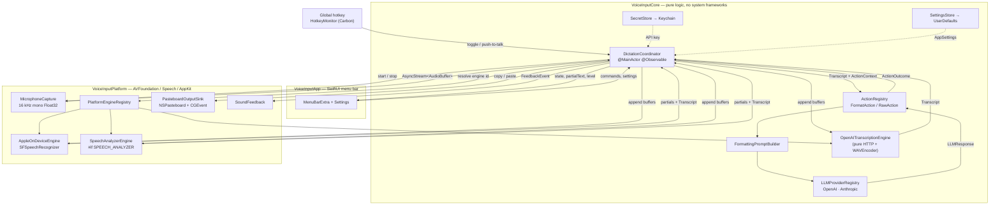
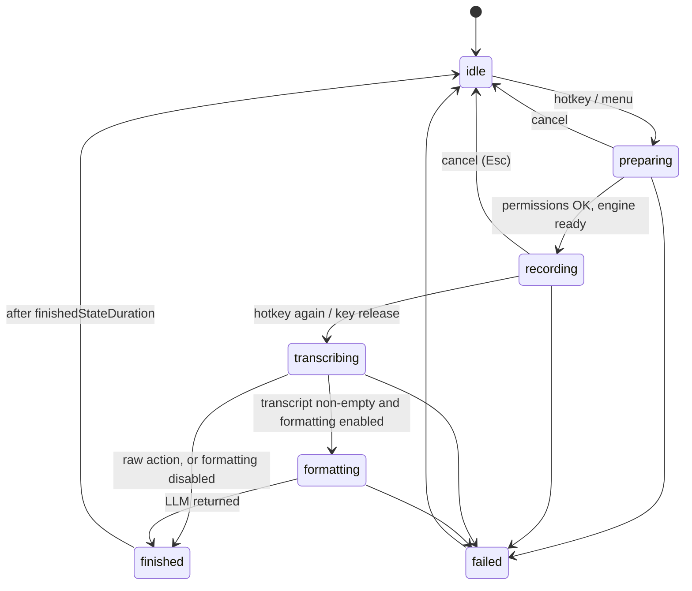

# Architecture

## Data flow

Everything crossing a subgraph boundary is a protocol declared in
`Sources/VoiceInputCore/Contracts/`. That is what keeps Core testable with fakes and
no I/O.

## Target boundaries

| Target | May import | Contains |
|---|---|---|
| `VoiceInputCore` | Foundation, Observation, os, Security | contracts, coordinator, actions, prompt building, LLM providers, cloud STT, WAV encoding, Keychain/UserDefaults stores |
| `VoiceInputPlatform` | + AVFoundation, Speech, AppKit, Carbon, ServiceManagement | mic capture, Apple speech engines, hotkey, pasteboard/paste, permissions, sounds, login item |
| `VoiceInputApp` | + SwiftUI | `MenuBarExtra`, Settings window, HUD, dependency wiring |
| `VoiceInputCoreTests` | Core only | unit tests |

**Core must never import AppKit, AVFoundation, Speech, Carbon or SwiftUI.** Security
is allowed because the Keychain API is a C API with no UI and no audio; it keeps
`KeychainSecretStore` unit-testable alongside the rest of the storage layer.

Cloud STT lives in Core, not Platform, because it is only `URLSession` + a WAV
encoder — no system framework is involved, and that makes it fully testable through
`StubURLProtocol`. Apple's engines live in Platform because they are Speech.framework.

## State machine

`DictationState` (`Contracts/DictationState.swift`) is the single source of truth
the UI renders from.

- `isBusy` is true for `preparing`, `recording`, `transcribing`, `formatting`; the
  hotkey uses it to decide between start and stop.
- `finished(ActionOutcome)` carries the text plus whether it was copied and/or
  pasted, so the HUD can say what happened.
- `failed(VoiceInputError)` carries a typed error with a Japanese description and,
  where actionable, a recovery suggestion (open the right Privacy pane, open
  Settings to enter a key).
- Cancel is always available: it tears down the session, discards audio and text,
  and returns to `idle` without producing output.

## Threading and actor rules

- **`DictationCoordinator` is `@MainActor`.** All state mutation and all SwiftUI
  observation happen on the main actor. Do not call its private methods from a
  background context.
- **Long work is `async` and awaited from the main actor**, not dispatched onto it.
  The coordinator holds its in-flight work in `Task` handles (`startTask`,
  `processTask`, `captureTask`, `partialsTask`) so `cancel()` can tear everything
  down deterministically.
- **Audio arrives off the main thread.** `AudioCapturing.start(format:)` returns an
  `AsyncStream<AudioBuffer>` fed from the AVAudioEngine tap thread. Never do work in
  the tap callback beyond converting and yielding the buffer — it runs under a
  realtime deadline.
- **Everything crossing a boundary is `Sendable`.** Contracts are `Sendable`
  protocols; value types (`AudioBuffer`, `Transcript`, `AppSettings`,
  `ActionOutcome`) are `Sendable` structs.
- **Reference types that need a lock** (`MicrophoneCapture`, `SoundFeedback`,
  `RecordingFeedbackPresenter`) are `@unchecked Sendable` with an `NSLock` and keep
  the critical section tiny. Never take a lock across an `await` — `NSLock.lock()`
  is unavailable from async contexts under Swift 6 for exactly that reason; use a
  synchronous `locked { }` helper.
- **Engines are `Sendable` values; sessions are reference types** with a defined
  lifecycle: `makeSession` → repeated `append` → exactly one of `finish()` /
  `cancel()`. A session is single-use.
- The package builds in Swift language mode **v5** with Swift 6 concurrency
  diagnostics visible as warnings. Treat those warnings as errors in review — the
  intent is to be clean under mode v6.

## Where things get wired together

`VoiceInputApp` is the only place that constructs concrete implementations:
`MicrophoneCapture`, `PlatformEngineRegistry`, `LLMProviderRegistry.live()`,
`ActionRegistry.live`, `UserDefaultsSettingsStore`, `KeychainSecretStore`,
`PasteboardOutputSink`, `SoundFeedback` — then hands them to `DictationCoordinator`.
Tests construct the same coordinator with fakes from
`Sources/VoiceInputCore/Pipeline/Fakes.swift`.
