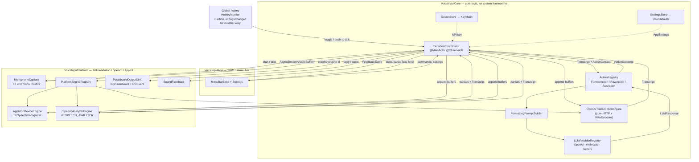
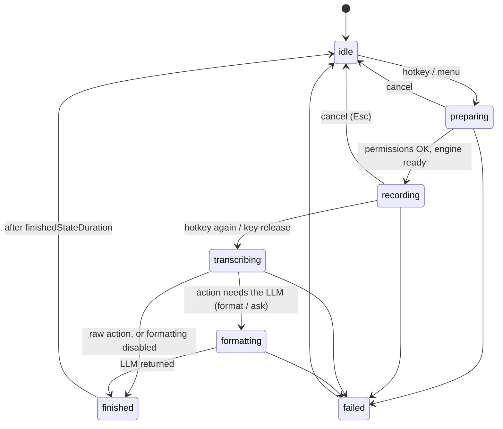

# Architecture

## Data flow

Everything crossing a subgraph boundary is a protocol declared in
`Sources/VoiceInputCore/Contracts/`. That is what keeps Core testable with fakes and
no I/O.

## Target boundaries

| Target | May import | Contains |
|---|---|---|
| `VoiceInputCore` | Foundation, Observation, os, Security | contracts, coordinator, actions, prompt building, LLM providers, cloud STT, WAV encoding, Keychain/UserDefaults stores |
| `VoiceInputPlatform` | + AVFoundation, Speech, AppKit, Carbon, ServiceManagement | mic capture, Apple speech engines, hotkey, pasteboard/paste, permissions, sounds, login item |
| `VoiceInputApp` | + SwiftUI | `MenuBarExtra`, Settings window, HUD, dependency wiring |
| `VoiceInputCoreTests` | Core only | unit tests |

**Core must never import AppKit, AVFoundation, Speech, Carbon or SwiftUI.** Security
is allowed because the Keychain API is a C API with no UI and no audio; it keeps
`KeychainSecretStore` unit-testable alongside the rest of the storage layer.

Cloud STT lives in Core, not Platform, because it is only `URLSession` + a WAV
encoder — no system framework is involved, and that makes it fully testable through
`StubURLProtocol`. Apple's engines live in Platform because they are Speech.framework.

## State machine

`DictationState` (`Contracts/DictationState.swift`) is the single source of truth
the UI renders from.

- `isBusy` is true for `preparing`, `recording`, `transcribing`, `formatting`; the
  hotkey uses it to decide between start and stop.
- `finished(ActionOutcome)` carries the text plus whether it was copied and/or
  pasted, so the HUD can say what happened. `ActionOutcome.presentation` decides how
  long it stays: `.transient` (a dictation) times out after `finishedStateDuration`,
  `.persistent` (an answer) holds the state until `dismissFinished()` — a timer cannot
  know when the user has finished reading. `.finished` is not `isBusy`, so a waiting
  answer never blocks the next recording.
- `failed(VoiceInputError)` carries a typed error with a Japanese description and,
  where actionable, a recovery suggestion (open the right Privacy pane, open
  Settings to enter a key).
- A formatting failure does not cost the user their dictation. When the `.format`
  action throws after a transcript exists, the coordinator delivers the raw
  transcript the way formatting-off would have — copied to the clipboard, and
  pasted too when auto-paste is on — records it in the history, and sets
  `rawTranscriptSalvaged` so the HUD and the menu can say the text was kept.
  This is `.format` only: a failed question has no answer to substitute.
- Cancel is always available: it tears down the session, discards audio and text,
  and returns to `idle` without producing output.
- `preparing` cannot last forever. Opening an engine session probes the OS speech
  daemons over XPC, and a wedged daemon can simply never answer; the coordinator
  races the whole engine-opening step against `preparationTimeout` (10 s) and fails
  with `.preparationTimedOut` rather than waiting. The stuck probe is abandoned, so
  the *next* start builds a fresh session over a fresh connection — pressing the
  hotkey again reconnects once the daemon recovers, no app restart needed. The
  permission preflight runs before the clock starts: its TCC dialog waits on the
  user, and that wait must not count. A session that opens after the deadline is
  cancelled, never leaked. (`Pipeline/PreparationTimeout.swift`;
  `AppleOnDeviceEngine` additionally keeps these blocking probes off the
  cooperative thread pool so an abandoned one costs a thread, not the app.)
- Asking a question adds **no state**. `AskAction` walks the same path as
  `FormatAction`, so `formatting` covers "waiting on the LLM" either way;
  `DictationCoordinator.currentAction` is what the HUD reads to say 「回答を作成中…」
  instead of 「整形中…」. Adding a state per action would multiply the machine for a
  purely cosmetic difference.

### Hotkeys have two backends

`HotkeyBinding.keyCode` is optional, and that decides the mechanism:

| Binding | Mechanism | Accessibility |
|---|---|---|
| key + modifiers (⌥Space) | Carbon `RegisterEventHotKey` | not needed |
| modifiers only (⇧⌃) | `NSEvent` global + local `flagsChanged` monitors | **required** |

Carbon cannot express a modifier-only shortcut at all, and watching modifier flags
globally is exactly what Accessibility gates. The Carbon path stays the default so
that a fresh install can dictate before granting anything.

The decision of *when* held modifiers count as a press lives in
`ModifierHotkeyDetector` (Core, unit-tested): in `.toggle` mode the shortcut fires
on **release**, and only if no other key and no extra modifier joined the hold —
otherwise ⇧⌃ would fire every time the user pressed ⌃⇧→. `.pushToTalk` brackets the
hold directly and needs no such guard.

### More than one shortcut: `HotkeyPurpose` and `HotkeyPlan`

The question shortcut and every formatting style may carry a shortcut of their own, so
`HotkeyMonitor` holds a set of registrations rather than one. Each is tagged with a
`HotkeyPurpose` (`.dictation`, `.ask` or `.style(UUID)`), the Carbon event carries its
`EventHotKeyID`, and the press is routed back to the purpose that owns it.
`HotkeyPurpose.actionID` is what maps a press to a `VoiceActionID`, so the app layer
never invents that mapping.

`HotkeyPlan.make(for:)` (Core, unit-tested) turns `AppSettings` into that set and is
where the rules live:

- the main dictation shortcut always wins; `.ask` is claimed next, then styles in
  Settings order, and the first claim on a combination keeps it,
- a duplicate is **rejected with a reason** rather than handed to Carbon, which
  would fail opaquely — `rejections` is keyed by style, and `askRejection` carries
  the question shortcut's, which belongs to no style,
- a modifier-only binding is allowed only for `.dictation` — it is the one shape
  that costs a permission and a permanent event monitor, so it is not multiplied
  across styles or given to `.ask`.

A registration that still fails (another app owns the combination) takes down only
itself: the remaining shortcuts stay live, and the reason is surfaced next to that
style in Settings. Losing your dictation shortcut because one style clashed would be
a bad trade.

**Known blind spot:** `RegisterEventHotKey` returning `noErr` is *not* proof the app
will receive the key. Observed on macOS 15: a combination already claimed by another
process registers successfully and the events keep going to the earlier claimant, and
an Option-bearing combination can be swallowed by the input source before Carbon sees
it. Either way the app believes it is registered, so Settings shows no warning and the
shortcut is silently inert. There is no API to detect it, so the only remedy is
diagnosis: `AppEnvironment` logs one `registered:` line per registration pass
(purposes and error kinds, never key codes or content) and one `pressed:` line per
press, in category `hotkey`. No `pressed:` line means the key never arrived, and the
fix is a different combination.

### A style is chosen per dictation, not per session

`DictationCoordinator.styleOverrideID` holds a formatting style for the dictation in
flight — set by a style shortcut, or in the HUD while recording. It is deliberately
**not** persisted: it travels to the action as a copy of the settings
(`AppSettings.selectingStyle(_:)`), and the default in Settings/the menu only ever
changes where the user explicitly changes it. `start` resets it, `cancel` and the end
of a run clear it.

Pressing a *different* style's shortcut while recording switches the dictation
instead of ending it (`toggle(action:styleID:)`); the style already in effect, or the
plain shortcut, stops as usual.

### Screen context is gathered early and validated late

`AppSettings.screenContextEnabled` (off by default) lets the formatting LLM see the
text of the frontmost window, so it can fix a misrecognised product name. The
pipeline touches it at three points, and the distance between them is the design:

1. **At recording start**, `beginScreenContextCapture()` kicks off
   `ScreenContextProviding.currentContext()` as an unstructured task, so the
   ScreenCaptureKit capture and the Vision OCR run while the user is still
   speaking and cost no perceptible wait. It is skipped entirely when the action
   in flight has `requiresLLM == false` — 整形オフ means the screen is never read,
   not merely unused.
2. **At formatting time**, `makeContext(for:)` awaits that task through
   `withDeadline`, so a stalled capture bounds out instead of holding a finished
   dictation. The result reaches the action as `ActionContext.screenContext`.
3. **Inside `FormatAction`**, `FormattingPromptBuilder` truncates and fences the
   text, and `ScreenContextGuard` inspects the reply. A contaminated reply is
   discarded and the dictation is formatted once more with no screen context at all.

`ScreenContext` holds one field, and it both travels to the provider and serves as
the guard's reference for what the screen said. An earlier version split those roles
— filtered words for the prompt, full text kept local — and gave that up because the
filtering did not correct anything; `docs/SECURITY.md` records the measurements and
what the reversal costs. Core owns the truncation, fencing and inspection as pure
functions; Platform owns only the capture.

## Threading and actor rules

- **`DictationCoordinator` is `@MainActor`.** All state mutation and all SwiftUI
  observation happen on the main actor. Do not call its private methods from a
  background context.
- **Long work is `async` and awaited from the main actor**, not dispatched onto it.
  The coordinator holds its in-flight work in `Task` handles (`startTask`,
  `processTask`, `captureTask`, `partialsTask`) so `cancel()` can tear everything
  down deterministically.
- **Audio arrives off the main thread.** `AudioCapturing.start(format:)` returns an
  `AsyncStream<AudioBuffer>` fed from the AVAudioEngine tap thread. Never do work in
  the tap callback beyond converting and yielding the buffer — it runs under a
  realtime deadline.
- **Everything crossing a boundary is `Sendable`.** Contracts are `Sendable`
  protocols; value types (`AudioBuffer`, `Transcript`, `AppSettings`,
  `ActionOutcome`) are `Sendable` structs.
- **Reference types that need a lock** (`MicrophoneCapture`, `SoundFeedback`,
  `RecordingFeedbackPresenter`) are `@unchecked Sendable` with an `NSLock` and keep
  the critical section tiny. Never take a lock across an `await` — `NSLock.lock()`
  is unavailable from async contexts under Swift 6 for exactly that reason; use a
  synchronous `locked { }` helper.
- **Engines are `Sendable` values; sessions are reference types** with a defined
  lifecycle: `makeSession` → repeated `append` → exactly one of `finish()` /
  `cancel()`. A session is single-use.
- The package builds in Swift language mode **v5** with Swift 6 concurrency
  diagnostics visible as warnings. Treat those warnings as errors in review — the
  intent is to be clean under mode v6.

## Where things get wired together

`VoiceInputApp` is the only place that constructs concrete implementations:
`MicrophoneCapture`, `PlatformEngineRegistry`, `LLMProviderRegistry.live()`,
`ActionRegistry.live`, `UserDefaultsSettingsStore`, `KeychainSecretStore`,
`PasteboardOutputSink`, `SoundFeedback` — then hands them to `DictationCoordinator`.
Tests construct the same coordinator with fakes from
`Sources/VoiceInputCore/Pipeline/Fakes.swift`.
